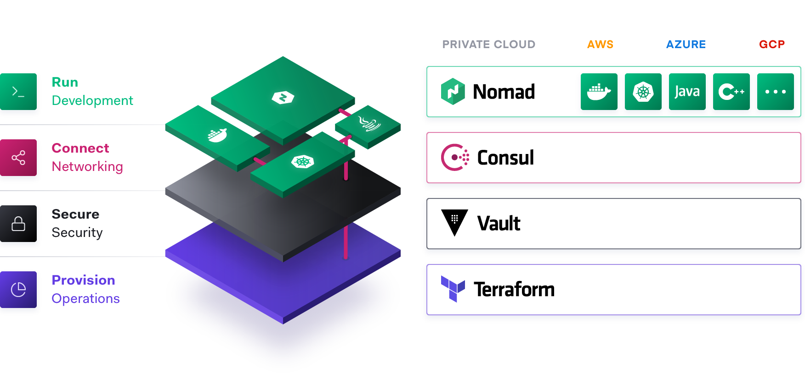

# Currently Under Development - 07/2021

## Overview

Deploy, secure, and scale a sample microservice application with the Hashistack (Terraform, Consul, and Vault).



## Prerequisites

- Docker
- Terraform v0.14+

## Deployment procedure

1. Clone [learn-consul-docker](https://github.com/hashicorp/learn-consul-docker) repository.
2. Navigate to this directory.
3. Edit the terraform `pwd` variable to the absolute path of your working directory
4. `terraform init`
5. `terraform apply`

## Testing procedure

1. Navigate to [http://localhost:9090/ui/](http://localhost:9090/ui/).
2. Notice the architecture of the application stack. 
3. Navigate to [http://localhost:8500/ui/dc1/services](http://localhost:8500/ui/dc1/services)
4. Notice the services and nodes being monitored by Consul.
5. Install Consul on each container:
   1. `docker exec -d web apk add consul`
   2. `docker exec -d api apk add consul`
6.  Start the Consul agent manually on each container:
    1.  `docker exec -d web consul agent --config-dir=/var/consul/config/`
    2.  `docker exec -d api consul agent --config-dir=/var/consul/config/`
7.  Navigate to [http://localhost:8500/ui/dc1/services](http://localhost:8500/ui/dc1/services)
8.  Notice the services, health checks, and nodes now being monitored by Consul.
9.  more consul content
10. Check the container logs to get the root token generated by Vault
    1.  `docker logs vault`
11. Navigate to [http://localhost:8200/ui/](http://localhost:8200/ui/).
12. Login using the root token.
13. more vault content
14. consul + vault content (use-cases)
15. scaling with terraform + consul + vault + application


## Additional information

- [https://www.hashicorp.com/cloud-operating-model](https://www.hashicorp.com/cloud-operating-model)
- [https://learn.hashicorp.com/collections/consul/docker](https://learn.hashicorp.com/collections/consul/docker)

## Application reference

This demo consists of two example services, Web (HTTP) and API (gRPC).

```
web (HTTP)  --
                api (gRPC)
```

## Gratitude

- [Nic Jackson @ Hashicorp](https://github.com/nicholasjackson)
- [Rosemary Wang @ Hashicorp](https://github.com/joatmon08)