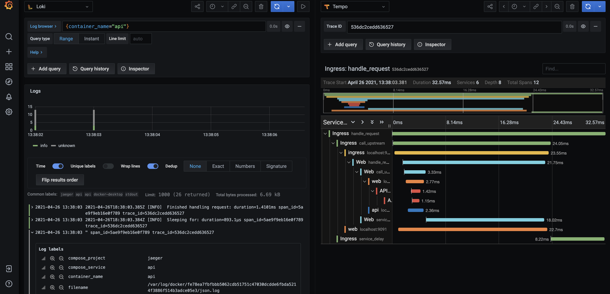
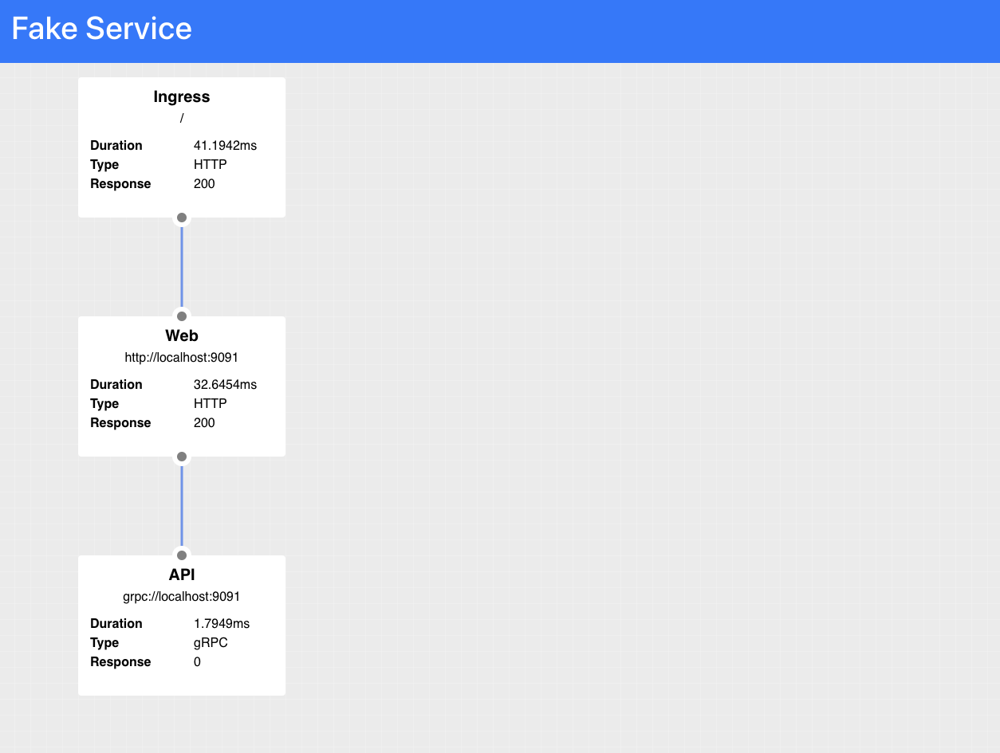

## Overview

Deploy a Consul datacenter, an application stack, and an observability stack (Grafana + Loki + Tempo + Prometheus + Node-Exporter). These resources will be used to provide complete service mesh observability capabilities.



## Prerequisites

- Docker
- Docker Compose
- Linux or OSX

## Deployment procedure

1. Clone [learn-consul-docker](https://github.com/hashicorp/learn-consul-docker) repository.
2. Navigate to this directory.
3. Install the Loki logging drivers for Docker: `docker plugin install grafana/loki-docker-driver:latest --alias loki --grant-all-permissions`
4. `docker-compose up -d`

## Testing procedure

1. Navigate to [http://localhost:8500/ui/dc1/services](http://localhost:8500/ui/dc1/services)
2. Notice the services being monitored by Consul.
3. Navigate to [http://localhost:9090/ui/](http://localhost:9090/ui/) and refresh the page to generate traffic.
4. Notice the architecture of the application stack. 
5. Navigate to [http://localhost:9092/targets](http://localhost:9092/targets).
6. Notice that Prometheus is pre-configured to scrape data from four endpoints: Consul, Node-Exporter, Tempo, and itself.
7. Navigate to [http://localhost:3000/datasources](http://localhost:3000/datasources).
8. Notice that Grafana is pre-configured with Prometheus, Loki, and Tempo as data sources.
9. Navigate to [http://localhost:3000/explore](http://localhost:3000/explore).
10. Set `Loki` as the data source in the top-left drop down.
11. Execute a search with these parameters: `{container_name="web"} |= "trace_id"`
12. Open one of the log lines, locate the `TraceID` field, then click the nearby `Tempo` link to jump directly from logs to traces.
13. Notice how application communication traverses throughout the service mesh.
14. Navigate to [http://localhost:3000/dashboards](http://localhost:3000/dashboards).
15. Explore the metrics-related dashboards: Consul Server Monitoring and Node Exporter.

## Additional information

- [https://learn.hashicorp.com/collections/consul/docker](https://learn.hashicorp.com/collections/consul/docker)
- [https://learn.hashicorp.com/tutorials/consul/monitor-datacenter-health](https://learn.hashicorp.com/tutorials/consul/monitor-datacenter-health)
- [https://learn.hashicorp.com/tutorials/consul/kubernetes-layer7-observability](https://learn.hashicorp.com/tutorials/consul/kubernetes-layer7-observability)
- [https://www.consul.io/docs/agent/telemetry](https://www.consul.io/docs/agent/telemetry)
- [https://learn.hashicorp.com/tutorials/consul/monitor-datacenter-health](https://learn.hashicorp.com/tutorials/consul/monitor-datacenter-health)

## Application reference

This demo consists of three services Ingress (HTTP), Web (HTTP), and API (gRPC)  which are configured to communicate using Consul Service Mesh. 

```
ingress (HTTP) --
                  web (HTTP) --
                                api (gRPC, 20% error rate)
```

Tracing has been configured for both the application instances and Envoy proxy using the Zipkin protocol, the spans 
will be collected by the bundled Jaeger instance.



## Gratitude

- [Nic Jackson @ Hashicorp](https://github.com/hashicorp/consul-demo-tracing/tree/master/jaeger)
- [Joe Elliot @ Grafana Labs](https://github.com/grafana/tempo/tree/main/example/docker-compose)